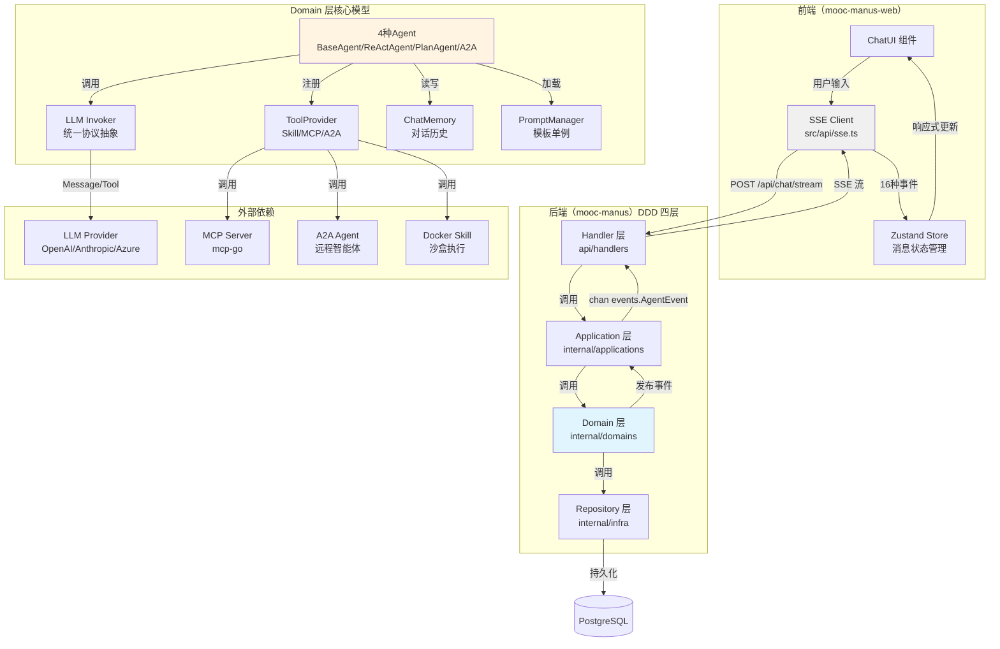

# 架构总览

## 为什么需要这份文档

mooc-manus-all 是一个**智能体编排全栈系统**，采用 mono-repo via git submodule 组织，前后端协议层（SSE 事件契约）与三仓 harness 体系形成紧密耦合。新成员（人类 / AI agent）需要快速建立"三仓各自职责 + 协作界面"的心智模型，本文档提供**唯一全栈架构视图**。

## 现状

### 仓库结构

```
mooc-manus-all/           # 总仓（mono-repo root）
├── mooc-manus/           # 后端子仓（Go + DDD）
├── mooc-manus-web/       # 前端子仓（React + TypeScript）
├── docs/superpowers/     # 跨仓 specs / plans
└── .harness/             # 总仓 harness（跨仓约束）
```

三仓通过 git submodule 链接：总仓指针指向子仓特定 commit SHA。子仓独立开发、测试、commit，总仓通过升级指针整合（详见 R-10）。

### 全栈架构图



### 关键设计决策

1. **DDD 四层严格分层**：Handler → Application → Domain → Repository，上层依赖下层，下层不得反向依赖（R-40）
2. **事件驱动架构**：Domain 层通过 `chan events.AgentEvent` 向上游推送 16 种 SSE 事件，Application 层序列化为 SSE 流（R-45）
3. **LLM 协议抽象**：`Message` / `Tool` / `ToolCall` 值对象 + `Invoker` 接口，隔离各家 LLM SDK 差异（R-42，ADR-0001）
4. **三类工具统一注册**：Skill（内置 Docker 沙盒）、MCP（接 mcp-go）、A2A（远程 agent），都通过 `ToolProvider` 注册为 `tools.Tool`（R-44）
5. **单一 PromptManager**：所有 system prompt / plan / react / a2a 模板由全局单例统一加载，支持 skill 动态注入（R-46）

## 数据流示例

### 典型对话流程（ReActAgent + MCP 工具调用）

1. 前端用户输入 → `POST /api/chat/stream`
2. Handler 层解析请求 → Application 层 `ChatService.StreamChat`
3. Application 调用 Domain 层 `ReActAgent.Run` → 异步监听 `chan events.AgentEvent`
4. ReActAgent 调用 `Invoker.CallWithTools` → LLM 返回 `tool_call`
5. 发布 `tool_call_start` 事件 → ToolProvider 调用 MCP 工具 → 发布 `tool_call_complete` 事件
6. LLM 总结响应 → 发布 `message` / `message_end` → 发布 `done`
7. Application 层序列化事件为 SSE 流 → Handler 推送到前端
8. 前端 EventSource 订阅 → 解析事件 → 更新 Zustand store → ChatUI 响应式渲染

### 子仓协作流程（全栈功能开发）

1. **后端开发**：在 `mooc-manus/` 分支开发 → 通过单测 → commit & push
2. **前端开发**：在 `mooc-manus-web/` 分支开发 → ESLint 通过 → commit & push
3. **总仓集成**：在 `mooc-manus-all/` 升级两个子模块指针 → 一次升级一个子仓（两个 commit）
4. **验证**：总仓 CI 跑 `validate-contracts.sh` 检查 SSE 事件契约、DTO 一致性
5. **完成**：总仓 PR merge（遵循 R-30 不直推 master）

## 与其他 harness 文档的关系

- **R-10**：子模块协作纪律（禁止在总仓直接改子仓文件）
- **R-20**：前后端契约（16 种 SSE 事件 + DTO 结构）
- **R-40**：DDD 分层职责（后端四层依赖方向）
- **R-42**：LLM 协议抽象（Message / Tool 值对象）
- **R-43**：Agent 编排（4 种 Agent 调用时机）
- **R-45**：事件发布（16 种事件 payload 必填字段）
- **glossary.md**：术语表（Agent / Tool / Plan / Step / Event 等）
- **event-protocol.md**：16 种 SSE 事件详解（与 R-20 / R-45 对齐）
- **submodule-workflow.md**：子模块协作剧本（引用 R-10）

## 例子

### 新增 SSE 事件类型的跨仓影响

假设要新增 `agent_thinking` 事件（显示 Agent 推理过程）：

1. **后端**：
   - `mooc-manus/internal/domains/models/events/constants.go` 新增常量 `EventTypeAgentThinking`
   - `events/events.go` 新增 `ThinkingEvent` 结构体
   - `ReActAgent.Run` 中适当位置发布该事件
   - 单测覆盖事件顺序

2. **前端**：
   - `mooc-manus-web/src/api/sse.ts` 的 `EventType` 枚举新增 `agent_thinking`
   - `src/types/` 新增 TS 类型 `ThinkingEvent`
   - `ChatUI` 组件订阅并渲染该事件

3. **契约保证**：
   - 写 ADR 说明新事件用途、payload 结构、向后兼容策略
   - CI 跑 `validate-contracts.sh` 检查前端 EventType ⊆ 后端定义

4. **升级指针**：
   - 总仓分别升级 `mooc-manus` 和 `mooc-manus-web` 指针
   - commit message：`chore: 升级 mooc-manus 至 abc123（新增 agent_thinking 事件）`

## 验证方式

```bash
# 检查三仓结构
ls -la mooc-manus mooc-manus-web

# 检查事件契约一致性
.harness/scripts/validate-contracts.sh

# 检查子模块指针
git submodule status

# 检查 DDD 四层结构
ls mooc-manus/internal/{applications,domains,infra}
ls mooc-manus/api/handlers
```
