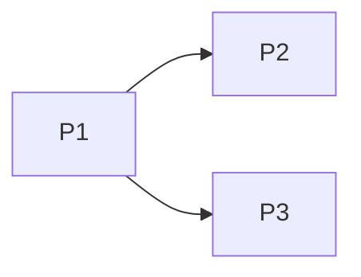

# 实施计划：<标题>

> 模板来源：`.harness/workflows/3-plan/template.md`。plan 本体落地路径：`docs/superpowers/plans/<date>-<topic>.md`。

## Goal

1-2 段，写清"本 plan 完成时，仓库 / 系统将进入的目标状态"。强调可观察的差异，不是步骤罗列。

## Architecture / Tech Stack

- 后端：Go DDD（interfaces / applications / domains / infrastructure）
- 前端：React + Vite + TypeScript
- 协议：MCP、A2A（agent-to-agent）、SSE、WebSocket
- 仓结构：mooc-manus-all（总仓） + mooc-manus（后端 submodule） + mooc-manus-web（前端 submodule）

## Spec link

`docs/superpowers/specs/<date>-<topic>-design.md`（§N 是本 plan 主要落地节）

## Total scope

- 涉及仓：<列出>
- 涉及 DDD 层：<列出>
- 是否动 .harness：<是 / 否，若是列出 rules / hooks / agents 改动>
- 是否动 submodule 指针：<是 / 否>
- 预估工作量：<工日>

## Working dir

每个 Phase / Task 必须显式声明 `Working dir:`（`mooc-manus-all/` / `mooc-manus-all/mooc-manus/` / `mooc-manus-all/mooc-manus-web/`），避免 subagent 跑错位置。

## Commit conventions

参见 `.harness/workflows/4-implement/commit-conventions.md`。原则：
- 每 Task 单 commit（exception：明确写在 Task 内的 "N commits"）
- 子仓改动必须在子仓内 commit，总仓只 commit 子模块指针升级
- 跨仓修改：先子仓 commit → 总仓 `chore: 升级子模块指针(<name>)`

## Phase 1: <阶段名>（关键路径 / 并行支线、估时）

目标：1 段话。

**Working dir:** `mooc-manus-all/...`

### Task 1.1: <任务名>

- [ ] **Step 1: <动作>**

```bash
# 具体命令
```

- [ ] **Step 2: <验证>**

完成判定（DoD）：<可观测的判据，例如"validate-harness.sh 退出码 0"或"指定 endpoint 返回新 schema">

### Task 1.2: ...

> ✅ Phase 1 完成检查：<整段验收条件>

---

## Phase 2: ...

（同上结构）

## 依赖图（建议 mermaid）



## 风险与回滚

- 每 Phase 列 1-3 个风险与对应回滚动作（git revert / 子模块指针回滚 / DB 迁移回滚）
